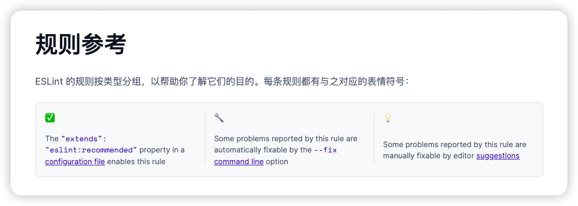
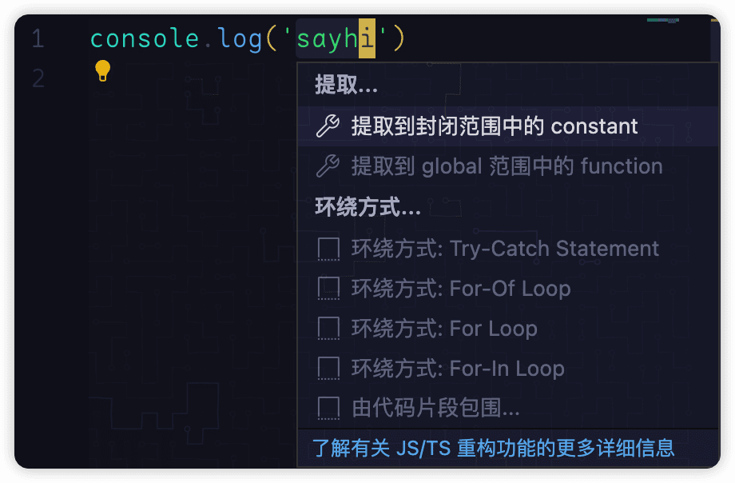

# VSCode 中的 format 与 lint 的自动格式化配置

在日常工作中, 经常遇到项目代码格式化与质量检测的规范配置不一致的问题, 导致在使用 VSCode 的时候，很难上来就能够做到编辑一个代码在保存的时候
完成自动格式化，甚至还有项目同时使用了 Prettier/ESLint 保存的时候会有冲突，总有报错， 快乐--; 为此仔细研究了一下格式化与 lint 相关的东西，做下日常脑子使用记录

## 名词解释

**formatter 格式化**: 很直观；具体来讲, 规则都是一些像 行最大长度/无混合空格和制表符/关键字间距/逗号样式...等, 不会对代码的执行逻辑产生任何影响的书写格式 ~~当然这里排除某些需要拿着游标卡尺写的语言~~，更多是为阅读的时候的舒适性, 或者团队一致性. 比较常见的是 [Prettier](https://www.prettier.cn/docs)

**lint 质量检测**： lint 这个词比较有意思, 本意上是指*衣服的毛球* , Linting 是指去除衣服上的毛球，引申意思就成了提高代码质量。
除了大名鼎鼎的 [ESLint](https://zh-hans.eslint.org/docs/latest/use/getting-started), 之前还有 Douglas Crockford (JavaScript: The Good Parts 作者) 编写的 [JSLint](https://www.jslint.com/), 检查规则偏向于如: 无未使用的变量/无额外绑定/无隐式全局变量...
等一些潜在的代码质量问题.

## Prettier vs. Linters Prettier 官网有一段解释的很明白

Linters have two categories of rules:

> 代码质量工具有两类规则：

1. **Formatting rules**: eg: max-len, no-mixed-spaces-and-tabs, keyword-spacing, comma-style…
   > 格式化规则：例如：max-len、no-混合空格和制表符、关键字行间距、逗号样式…

Prettier alleviates the need for this whole category of rules! Prettier is going to reprint the entire program from scratch in a consistent way, so it’s not possible for the programmer to make a mistake there anymore :)

> Prettier 减轻了对整个规则类别的需求！Prettier 将以一致的方式从头开始重新打印整个程序，所以程序员不可能再犯错误了：）

2. **Code-quality rules**: eg no-unused-vars, no-extra-bind, no-implicit-globals, prefer-promise-reject-errors…
   > 代码质量规则：例如不使用变量、不额外绑定、不隐含全局变量、更喜欢承诺拒绝错误……

Prettier does nothing to help with those kind of rules. They are also the most important ones provided by linters as they are likely to catch real bugs with your code!

> Prettier 对这些规则没有任何帮助。它们也是 linter 提供的最重要的规则，因为它们可能会在您的代码中发现真正的错误！

In other words, use Prettier for formatting and linters for catching bugs!

> 换句话说，使用漂亮的格式化和 linter 捕捉错误！

又或者说， Prettier 可以处理部分格式化规则， 但 Linter 可以处理所有规则, ESLint 能够替代 Prettier 的工作， 但 Prettier 不能够替代 Eslint 的工作, 但是否 ESLint 就是直接最优选择呢? 不一定, 等看完本篇相信你会有自己的答案

重要 Tip: 针对 no-unused-vars, no-console 等规则， linter 一般会提供一些 `fix` 命令，将这些问题自动修复, 在 ESLint 规则介绍中， 每一条规则都有具体介绍是否能够自动修复


## VSCode 配置

与格式化和 lint 工具相关的配置有这么几项

```json
{
  "editor.formatOnSave": true,
  "editor.defaultFormatter": "formatter.id",
  "editor.codeActionsOnSave": {
    "source.fixAll": true
  }
}
```

### Formatter 格式化

- "editor.formatOnSave" 这个就是是否在保存的时候执行格式化
- "editor.defaultFormatter": "formatter.id" 这个用来指定你要使用格式化工具, 常用的有以下几个
  其实就是内置/外置插件的 id, 在 JSON 模式下编辑 VSCode 配置文件的时候会有代码提示不用死记硬背

```
vscode.typescript-language-features
vscode.json-language-features
vscode.html-language-features
vscode.css-language-features
stylelint.vscode-stylelint
dbaeumer.vscode-eslint
esbenp.prettier-vscode
```

### Code Actions & fix 代码操作和自动修复

- "editor.codeActionsOnSave" 这个比较有意思， 我们先来看看什么是 codeAction, 这是 VSCode 中的一个概念

[Code Actions = Quick Fixes and refactorings](https://code.visualstudio.com/docs/editor/refactoring#_code-actions-quick-fixes-and-refactorings)

代码操作 = 快速修复和重构

记得这个小灯泡吗？点击小灯泡或者快捷键 `cmd+.`, 这个就是手动调用的 `Code Actions`

那么 "editor.codeActionsOnSave" 就好理解了，就是在代码保存的时候要执行的 `Code Actions`, 截止目前， 他有两个选项

```
  source.fixAll: true, // 控制是否应在文件保存时运行自动修复操作。
  source.organizeImports: true, // 控制是否应在文件保存时运行"整理 import 语句"操作。
```

巧了吗这不是，这个 fix 就是在调用当前语言对应的 `linter` 的 fix 命令, 这是隐藏在的 VSCode 插件中所做的工作.

### 多语言配置

在我们的实际前端项目中，一般会遇到 html/css/less/js/jsx/ts/tsx 等多种类型的文件， 那该如何针对不同语言做配置呢

```json5
  "[html]": {
    "editor.defaultFormatter": "vscode.html-language-features",
    // ...
  },
  "[css]": {
    "editor.defaultFormatter": "vscode.css-language-features",
    // ...
  },
  "[js]": {
    "editor.defaultFormatter": "vscode.typescript-language-features",
    // ...
  }
```

像这样! 根据文件关联类型来分别配置

### 项目级别的配置

VSCode 的配置文件是支持全局/工作区的, 工作区的配置在 `.vscode/settings.json` 文件中， 工作区配置能够覆盖全局配置
针对团队合作项目，更推荐把对应的格式化配置保存在项目中， 这样一打开项目不需要任何配置就能够享受 Save -> 自动格式化啦

## 抄作业

1. 使用 Prettier 作为格式化, ESLint （需要安装 ESLint 插件）js/ts/jsx/tsx 自动修复

```json
  "editor.formatOnSave": true,
  "editor.defaultFormatter": "esbenp.prettier-vscode",
  "editor.codeActionsOnSave": {
    "source.fixAll": true
  }
```

2. 不是用 Prettier，使用各自 Linter

```json
  "[javascript]": { // js
    "editor.formatOnSave": true,
    "editor.defaultFormatter": "dbaeumer.vscode-eslint",
    "editor.codeActionsOnSave": {
      "source.fixAll": true
    }
  },
  "[javascriptreact]": { // js
    "editor.formatOnSave": true,
    "editor.defaultFormatter": "dbaeumer.vscode-eslint",
    "editor.codeActionsOnSave": {
      "source.fixAll": true
    }
  },
  "[typescript]": { // ts
    "editor.formatOnSave": true,
    "editor.defaultFormatter": "dbaeumer.vscode-eslint",
    "editor.codeActionsOnSave": {
      "source.fixAll": true
    }
  },
  "[typescriptreact]": { // tsx
    "editor.formatOnSave": true,
    "editor.defaultFormatter": "dbaeumer.vscode-eslint",
    "editor.codeActionsOnSave": {
      "source.fixAll": true
    }
  },
  "[css]": { // css
    "editor.formatOnSave": true,
    "editor.defaultFormatter": "stylelint.vscode-stylelint",
    "editor.codeActionsOnSave": {
      "source.fixAll": true
    }
  },
  "[less]": { // less
    "editor.formatOnSave": true,
    "editor.defaultFormatter": "stylelint.vscode-stylelint",
    "editor.codeActionsOnSave": {
      "source.fixAll": true
    }
  },

```

## 后起之秀

在 Rust 浪潮之下， Linter 工具当然也有创新啦, 也有工具志在统一前端的 Formatter & Linter

- [Rome](https://rome.tools/)
- [dprint](https://dprint.dev/)

可以自行尝试
